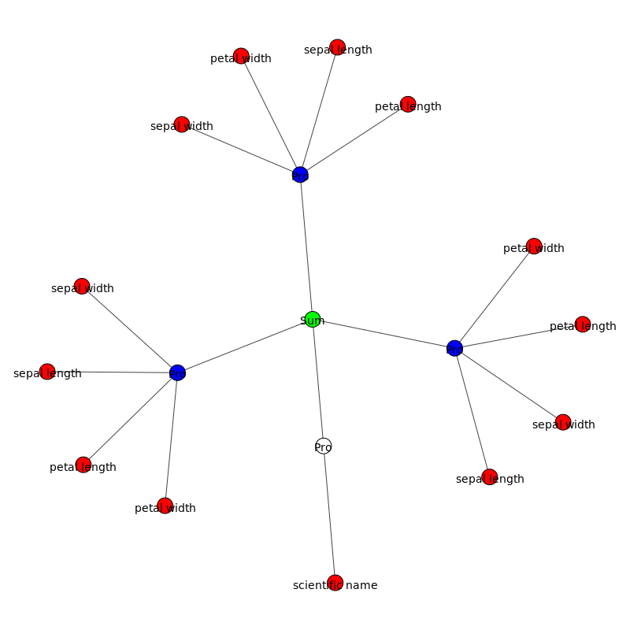

# Automatic data visualization and presentation via Sum Product Networks

## Introduction

This notebook is build on the MSPN implementation by Molina et.al. during the course of a bachelor thesis under the supervision of Alejandro Molina and Kristian Kersting at TU Darmstadt. The goal of this framework is to sum product networks for hybrid domains and to highlight important aspects and interesting features of a given dataset.

### Using this notebook
The whole notebook can be run as-is and will generate a complete report of the provided datasets. All parameters which have to be set are documented at the required locations, or in the configuration beforehand. The latter are mostly the rendering detail and similar variables which only influence the visual parts of the report

## Loading required files and libraries


```python
import pickle
import igraph

import ba_functions as f
import ba_plot as p
import pandas as pd
import numpy as np

from tfspn.SPN import SPN
from pprint import PrettyPrinter
from IPython.display import Image
from IPython.display import display
from importlib import reload

pp = PrettyPrinter()
```

    /home/iliricon/.virtualenvs/TF_SPN/lib/python3.6/site-packages/statsmodels/compat/pandas.py:56: FutureWarning: The pandas.core.datetools module is deprecated and will be removed in a future version. Please use the pandas.tseries module instead.
      from pandas.core import datetools


## Building the model

To build a model, you have to provide the dataset and several parameters for the generation of the SPN. The datasets need to be in csv format and should optimally be parsed as numeric data. Strings in the dataset will be transformed into numerical values representing the different possible values of the column.

If you do not pass a dataset and parameters, the mode will be trained on the iris dataset with several default parameters.

If you want to load a pretrained model that you save earlier, please refer to the section "Loading the model"


```python
# path to the dataset you want to use for training
dataset = "data/iris"

# the minimum number of datapoints that are included in a child of a 
# sum node
precision = 25

# the parameter which governs how strict the independece test will be
# 1 results in all features being evaluated as independent, 0 will 
# result in no features being acccepted as truly independent
independence = 0.1


spn, dictionary = f.learn_spn(dataset=dataset, 
                              precision=precision, 
                              independence=independence)
df = pd.read_csv(dataset)
```

    <class 'pandas.core.frame.DataFrame'>
    Int64Index: 150 entries, 0 to 149
    Data columns (total 5 columns):
    sepal length       150 non-null float64
    sepal width        150 non-null float64
    petal length       150 non-null float64
    petal width        150 non-null float64
    scientific name    150 non-null object
    dtypes: float64(4), object(1)
    memory usage: 7.0+ KB
    None
       sepal length  sepal width  petal length  petal width  scientific name
    0           5.1          3.5           1.4          0.2                0
    1           4.9          3.0           1.4          0.2                0
    2           4.7          3.2           1.3          0.2                0
    3           4.6          3.1           1.5          0.2                0
    4           5.0          3.6           1.4          0.2                0
    ['continuous', 'continuous', 'continuous', 'continuous', 'categorical']
    (150, 5)
    CLUSTER UNIVARIATE:False
    
    slices to go:  0 operation Cluster
    		# clusters found 2
    slices to go:  1 operation SplitFeatures
    		# clusters found 1
    slices to go:  1 operation SplitFeatures
    		# clusters found 1
    slices to go:  1 operation Cluster
    		# clusters found 2
    slices to go:  2 operation Cluster
    		# clusters found 2
    slices to go:  3 operation SplitFeatures
    		# clusters found 2
    slices to go:  4 operation NaiveFactorization
    slices to go:  8 operation SplitFeatures
    		# clusters found 2
    slices to go:  9 operation SplitFeatures
    		# clusters found 1
    slices to go:  9 operation SplitFeatures
    		# clusters found 1
    slices to go:  9 operation CreateLeaf
    slices to go:  8 operation CreateLeaf
    slices to go:  7 operation CreateLeaf
    slices to go:  6 operation CreateLeaf
    slices to go:  5 operation CreateLeaf
    slices to go:  4 operation CreateLeaf
    slices to go:  3 operation SplitFeatures
    		# clusters found 1
    slices to go:  3 operation CreateLeaf
    slices to go:  2 operation Cluster
    		# clusters found 2
    slices to go:  3 operation Cluster
    		# clusters found 2
    slices to go:  4 operation Cluster
    		# clusters found 2
    slices to go:  5 operation NaiveFactorization
    slices to go:  9 operation NaiveFactorization
    slices to go:  13 operation SplitFeatures
    		# clusters found 1
    slices to go:  13 operation NaiveFactorization
    slices to go:  16 operation NaiveFactorization
    slices to go:  19 operation NaiveFactorization
    slices to go:  22 operation CreateLeaf
    slices to go:  21 operation CreateLeaf
    slices to go:  20 operation CreateLeaf
    slices to go:  19 operation CreateLeaf
    slices to go:  18 operation CreateLeaf
    slices to go:  17 operation CreateLeaf
    slices to go:  16 operation CreateLeaf
    slices to go:  15 operation CreateLeaf
    slices to go:  14 operation CreateLeaf
    slices to go:  13 operation CreateLeaf
    slices to go:  12 operation Cluster
    		# clusters found 2
    slices to go:  13 operation CreateLeaf
    slices to go:  12 operation CreateLeaf
    slices to go:  11 operation CreateLeaf
    slices to go:  10 operation CreateLeaf
    slices to go:  9 operation CreateLeaf
    slices to go:  8 operation CreateLeaf
    slices to go:  7 operation CreateLeaf
    slices to go:  6 operation CreateLeaf
    slices to go:  5 operation CreateLeaf
    slices to go:  4 operation CreateLeaf
    slices to go:  3 operation CreateLeaf
    slices to go:  2 operation CreateLeaf
    slices to go:  1 operation NaiveFactorization
    slices to go:  4 operation NaiveFactorization
    slices to go:  7 operation CreateLeaf
    slices to go:  6 operation CreateLeaf
    slices to go:  5 operation CreateLeaf
    slices to go:  4 operation CreateLeaf
    slices to go:  3 operation CreateLeaf
    slices to go:  2 operation CreateLeaf
    slices to go:  1 operation CreateLeaf
    slices to go:  0 operation CreateLeaf


    /home/iliricon/Documents/Studium/7/BA/TF_SPN/TFSPN/src/tfspn/piecewise.py:279: FutureWarning: elementwise comparison failed; returning scalar instead, but in the future will perform elementwise comparison
      if bins == 'blocks':


## Loading a model
If you have trained a sum product network before, you can also reload the model and the dataset, without training it anew. This will save a lot of time for complex models.


```python
# path to the model pickle file
model_path = "models/test.pickle"

# path to the dataset (this is used for evaluate several methods)
data_path = "data/iris"


# UNCOMMENT THE FOLLOWING LINES TO LOAD A MODEL
#spn = SPN.from_pickle(model_path)
#dictionary = pickle.load(model_path + "_d")

#df = pd.read_csv(data_path)
```

## General statistical evaluation

The following modules outline several general statistical details of the dataset by evaluating the model. This serves to give a general, high level overview over the data.


```python
print()
print('The spn was build on a dataset of {} data points.'.format(len(df)))
print('The data contains {} features, which are {}.'.format(spn.numFeatures, ", ".join(spn.featureNames)))
print('The feature types are {}.'.format(", ".join(spn.featureTypes)))
```

    
    The spn was build on a dataset of 150 data points.
    The data contains 5 features, which are sepal length, sepal width, petal length, petal width, scientific name.
    The feature types are continuous, continuous, continuous, continuous, categorical.


The SPN approximates all continuous and discreet features by using piecewise linear approximations of their density function. For categorical data, it uses histograms of the different count values. 

To get a sense of the SPN as a whole, we can look at the whole graph. The spn is a tree, with a sum node at it's center.


```python
# WORKAROUND DUE TO LIBRARY ISSUES

graph, visual_style = p.plot_graph(spn=spn, fname="graph.png")
Image(filename='graph.png', width=600) 
#igraph.plot(graph, **visual_style)
```


The next function shows the mean and standard deviation of each feature for the whole network. Categorical features do not have a mean and a standard deviation, since they contain no ordering. You cannot, for example, find the "middle" between "male" and "female"


```python
print()
means = spn.root.moment(1, spn.numFeatures)
stds = np.sqrt(spn.root.moment(2, spn.numFeatures) - spn.root.moment(1,spn.numFeatures) ** 2)
print('{:>20}: {:>7} {:>7}'.format('FEATURE', 'MEAN', 'STD'))
for i, _ in enumerate(means):
    print('{:>20}: {:>7} {:>7}'.format(spn.featureNames[i], np.round(means[i], 2), np.round(stds[i], 2)))


```

    
                 FEATURE:    MEAN     STD
            sepal length:     5.8    0.79
             sepal width:    3.01    0.42
            petal length:    3.67    1.71
             petal width:    1.13    0.72
         scientific name:     nan     nan


In the following section, the marginal distributions for each feature is shown. This is the distribution of each feature without knowing anything about the other values.


```python
for i in range(spn.numFeatures):
    #TODO: Fix categorical
    p.plot_marginal(spn, i, dictionary=dictionary)
```


To get a sense of how the features relate to one another, we can look at the correlation between features. The correlation denotes how strongly two features are linked linearly, that means, how much one increases, while another does. A correlation of 1 means that a feature is a perfect linear increasing function of the other, when a correlation of -1 means that it is a decreasing function. A correlation of 0 means that no linear relationship exists between the two.

To make it easier to grasp the dependencies quickly, the correlation is reported in a colored matrix, where blue denotes a positive and red denotes a negative correlation. The diagonal has been omitted for better readability.


```python
high_correlation = 0.7

corr = f.get_correlation_matrix(spn)
p.matshow(corr, x_labels=spn.featureNames, y_labels=spn.featureNames)

idx = np.where(np.abs(corr) > high_correlation)

if len(idx[0]) == spn.numFeatures:
    print('No features are correlated very strongly (>{})'.format(high_correlation))

else:
    print('There is a high correlation (>{}) between the following features:'.format(high_correlation))
    for i, _ in enumerate(idx[0]):
        x = idx[0][i]
        y = idx[1][i]
        if x > y:
            print('{:>20} - {:20}: {}'.format(spn.featureNames[x], spn.featureNames[y], corr[x][y]))
    print('The combined marginal of these highly correlated features are shown below:')
    for i, _ in enumerate(idx[0]):
        x = idx[0][i]
        y = idx[1][i]
        if x > y:
            p.plot_related_features(spn, x, y)

```


    /home/iliricon/.virtualenvs/TF_SPN/lib/python3.6/site-packages/ipykernel_launcher.py:6: RuntimeWarning: invalid value encountered in greater
      


    There is a high correlation (>0.7) between the following features:
            petal length - sepal length        : 0.841331888238315
             petal width - sepal length        : 0.8382917641044947
             petal width - petal length        : 0.9766220469796177
    The combined marginal of these highly correlated features are shown below:


Since categorical values do not have a mean and a variance, we can also not calculate a correlation for them. But since for discreet values, it is very easy to compare the conditional distributions of the features, we can plot those.

The conditional distributions are the probabilities of the features, given a certain instance of a class. So for example instead of calculating the distribution of heights for all humans, we compare those for different genders.


```python
categoricals = [i for i, _type in enumerate(spn.featureTypes) if _type == 'categorical']

for cat in categoricals:
    for i in range(spn.numFeatures):
        if i != cat:
            p.plot_related_features(spn, i, cat)
```


## Cluster evaluation

The root node of the SPN is a sum node. This means that for a given data point, all children of the root node report a probability, and the complete probability of that node is weighted by the relative importance of the child. The complete probability is then calculated as the sum  fo these weighted child probabilities.

We can interpret these sum node children as clusters of the original data, since they are created by a clustering algorithm. These clusters capture different "sub-patterns" of the data, that we can analyse further.


```python
reload(f)
descr = f.get_node_description(spn, spn.root, spn.numFeatures)
print('The SPN contains {} clusters.\n'.format(descr['num']))
print('These are:')
for d in descr['nodes']:
    print('  - {}, representing {}% of the data.'.format(d['short_descriptor'], np.round(d['weight'] * 100, 2)))
    if d['quick'] != 'shallow':
        print('    - The node has {} children and {} descendants, resulting in a remaining depth of {}.'.format(d['num_children'], d['size'], d['depth']))

print()
print('The representatives of these nodes are:')
format_string = '{:>6}' + ('{:>16} ' * spn.numFeatures)
print(format_string.format('Node', *spn.featureNames))
for i, d in enumerate(descr['nodes']):
    print(format_string.format(i, *np.round(d['representative'][0],2)))

print('The nodes split the following features, because they are assumed to be independent of each other:')
print('{:>6}  {:>0}'.format('Node', 'Seperated features'))
for i, d in enumerate(descr['nodes']):
    print('{:>6}: {}'.format(i, ', '.join([str(e) for e in d['split_features']])))
```

    The SPN contains 5 clusters.
    
    These are:
      - a ProductNode, which seperates one feature, representing 33.33% of the data.
        - The node has 2 children and 17 descendants, resulting in a remaining depth of 3.
      - a ProductNode, which seperates one feature, representing 24.0% of the data.
        - The node has 2 children and 12 descendants, resulting in a remaining depth of 3.
      - a shallow ProductNode, representing 16.0% of the data.
      - a shallow ProductNode, representing 14.67% of the data.
      - a shallow ProductNode, representing 12.0% of the data.
    
    The representatives of these nodes are:
      Node    sepal length      sepal width     petal length      petal width  scientific name 
         0             5.2              3.4             1.42             0.19              0.0 
         1            6.35              2.7              5.1              1.8              2.0 
         2             5.4              2.8             4.68             1.51              1.0 
         3            5.72              2.0             4.05              1.0              1.0 
         4             5.8              2.2             5.05              1.4              2.0 
    The nodes split the following features, because they are assumed to be independent of each other:
      Node  Seperated features
         0: [4], [0, 1, 2, 3]
         1: [4], [0, 1, 2, 3]
         2: [0], [1], [2], [3], [4]
         3: [0], [1], [2], [3], [4]
         4: [0], [1], [2], [3], [4]


The node representatives are the most likely instances for each node. They are archetypical for what the node represents and what subgroup of the data it encapsules.

Shallow product nodes are nodes which split all remaining features and have only leaves as children.

The nodes are visualized bellow


```python
root = spn.root
weights_nodes = [(node, weight) for node, weight in zip(root.children, root.weights)]
weights_nodes.sort(key=lambda x: x[1])
weights_nodes.reverse()
nodes = [node[0] for node in weights_nodes]

for i, node in enumerate(nodes):    
    spn.root = node
    if f.get_spn_depth(node) > 1:
        print(i)
        graph, visual_style = p.plot_graph(spn=spn, fname="node" + str(i) + ".png")
        display(Image(filename="node" + str(i) + ".png", width=200))
spn.root = root
```

    0





    1


As stated above, each cluster captures a subgroup of the data. To get a feeling of which subgroup was captured, the means and variances for each feature and node are plotted below. This highlights where the node has its focus.


```python
node_means = np.array([node.moment(1, spn.numFeatures) for node in nodes])
node_stds = np.array([np.sqrt(node.moment(2, spn.numFeatures) - node.moment(1, spn.numFeatures) ** 2) 
                      for node in nodes])
names = np.arange(1,len(nodes)+1,1)
for i in range(spn.numFeatures):
    if i not in categoricals:
        p.plot_error_bar(names, node_means[:,i], node_stds[:,i])
```


Finally, since each node captures different interaction between the features, it is interesting to look at the correlations again, this time for the seperate nodes. Shallow nodes are omitted, because the correlation of independent variables is always 0.


```python
high_correlation = 0.7

root = spn.root
for node, d in zip(nodes, descr['nodes']):
    if not d['quick'] == 'shallow':
        spn.root = node
        corr = f.get_correlation_matrix(spn)
        p.matshow(corr, x_labels=spn.featureNames, y_labels=spn.featureNames)

        idx = np.where(np.abs(corr) > high_correlation)

        if len(idx[0]) == spn.numFeatures:
            print('No features are correlated very strongly (>{})'.format(high_correlation))

        else:
            print('There is a high correlation (>{}) between the following features:'.format(high_correlation))
            for i, _ in enumerate(idx[0]):
                x = idx[0][i]
                y = idx[1][i]
                if x > y:
                    print('{:>20} - {:20}: {}'.format(spn.featureNames[x], spn.featureNames[y], corr[x][y]))
            print('The combined marginal of these highly correlated features are shown below:')
            for i, _ in enumerate(idx[0]):
                x = idx[0][i]
                y = idx[1][i]
                if x > y:
                    p.plot_related_features(spn, x, y)

        spn.root = root

```


    /home/iliricon/.virtualenvs/TF_SPN/lib/python3.6/site-packages/ipykernel_launcher.py:10: RuntimeWarning: invalid value encountered in greater
      # Remove the CWD from sys.path while we load stuff.


    There is a high correlation (>0.7) between the following features:
    The combined marginal of these highly correlated features are shown below:


    There is a high correlation (>0.7) between the following features:
            petal length - sepal length        : 0.7969581638180125
    The combined marginal of these highly correlated features are shown below:


## Classification analysis

Since most machine learning models are used for classification, it is frequently a very interesting question, how these classifications result from the data. This can lead to further insigth into the domain behind the data and can highlight its complex interdependencies.

In the following sections, different explanation techniques are used, so that we can get a complete sense of the data. Since different techniques highlight different aspects of the data and the classification process, we can gain insights by comparing and contrasting the different approaches.

To prepare for the analysis, we first load the original data and split it along classes.


```python
df_numerical = df.copy(deep=True)
for i in categoricals:
    #df.iloc[:,i]
    transformed = dictionary['features'][i]['encoder'].transform(df_numerical.as_matrix()[:,i])
    df_numerical.iloc[:,i] = transformed

numerical_data = df_numerical.as_matrix()

categorical_data = {}
for i in categoricals:
    data = df_numerical.groupby(spn.featureNames[i])
    data = [data.get_group(x).as_matrix() for x in data.groups]
    categorical_data[i] = data
```

To evaluate the performance of the model, we count the number of occuring misclassifications for each categorical attribute and report the precision for that feature.


```python
misclassified = {}
for i in categoricals:
    y_true = numerical_data[:,i]
    query = np.copy(numerical_data)
    query[:,i] = np.nan
    y_pred = spn.root.mpe_eval(query)[1][:,i]
    misclassified[i] = np.where(y_true != y_pred)[0]
    misclassified_instances = misclassified[i].shape[0]
    print('For feature "{}" the SPN misclassifies {} instances, resulting in a precision of {}%.'.format(
            spn.featureNames[i], misclassified_instances, np.round(100 * (1 - misclassified_instances/len(df)),2)))
    print('These are:')
    print(df.iloc[misclassified[i],:])
```

    For feature "scientific name" the SPN misclassifies 7 instances, resulting in a precision of 95.33%.
    These are:
        sepal length  sepal width  petal length  petal width  scientific name
    56           6.3          3.3           4.7          1.6  Iris-versicolor
    70           5.9          3.2           4.8          1.8  Iris-versicolor
    72           6.3          2.5           4.9          1.5  Iris-versicolor
    73           6.1          2.8           4.7          1.2  Iris-versicolor
    77           6.7          3.0           5.0          1.7  Iris-versicolor
    83           6.0          2.7           5.1          1.6  Iris-versicolor
    85           6.0          3.4           4.5          1.6  Iris-versicolor


### Information gain through features

The first technique highlights the relative importance of different features for a classification. It can show us how different classes are predicted. A positive value shows that knowing the feature in average contributed to the correct classification, while not knowing the feature decreases the probability of the class.


```python
for i in categoricals:
    for query in categorical_data[i]:
        print('Relative feature importance for class "{}"" and value "{}":'.format(
            spn.featureNames[i], dictionary['features'][i]['encoder'].inverse_transform(int(query[0,i]))))
        print(f.get_feature_decomposition(spn, i, query))
```

    Relative feature importance for class "scientific name"" and value "Iris-setosa":
    [  3.10862447e-17   1.02140518e-16  -2.08419495e+00  -1.33226763e-17
       0.00000000e+00]
    Relative feature importance for class "scientific name"" and value "Iris-versicolor":
    [-0.00732737  0.00582925  0.02995187  0.00835043  0.        ]
    Relative feature importance for class "scientific name"" and value "Iris-virginica":
    [-0.09636977 -0.00868333  0.06821775  0.14376139  0.        ]

